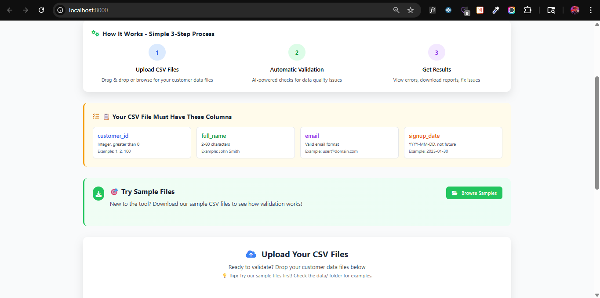
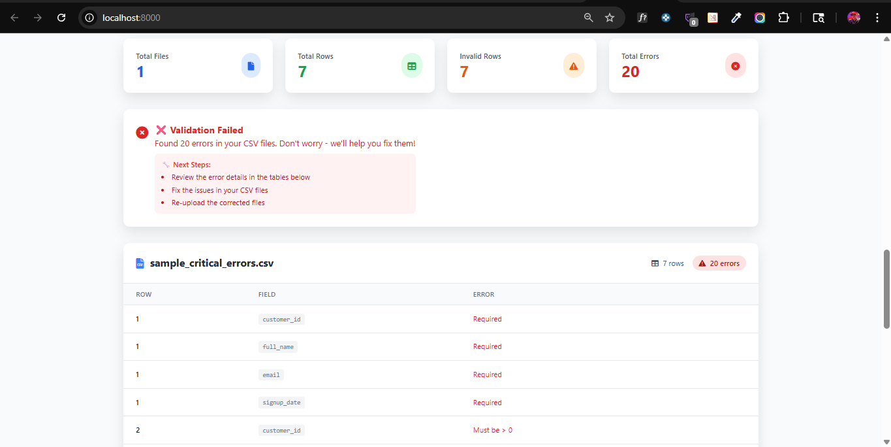
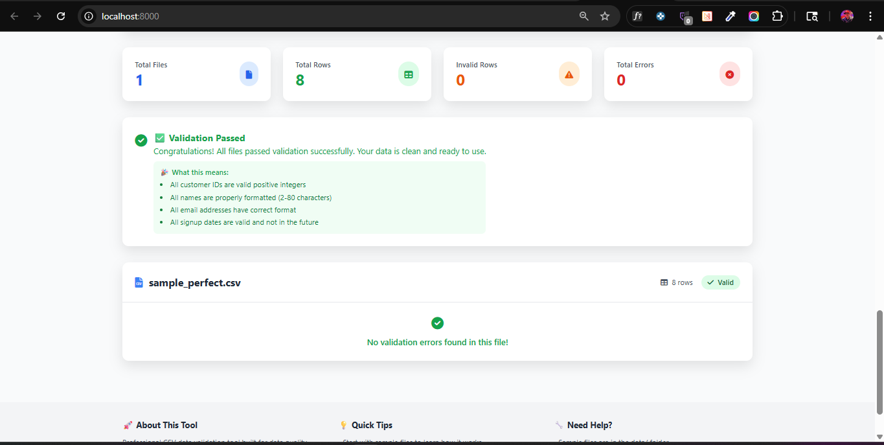

# 📊 Data Validator App

> **Professional CSV Data Validation Tool with Beautiful Web Interface**

A modern, enterprise-grade CSV validation application that combines powerful command-line functionality with an intuitive web dashboard. Perfect for data teams, developers, and businesses who need reliable data quality assurance.

[](https://python.org)
[](https://fastapi.tiangolo.com)
[](#testing)
[](#license)

---

## 🌟 **Features**

### 🖥️ **Dual Interface**
- **🎨 Modern Web UI**: Beautiful drag-and-drop interface with real-time validation
- **⚡ CLI Tool**: Pipeline-friendly command-line interface for automation

### 📋 **Comprehensive Validation**
- ✅ **Customer ID**: Integer validation, positive values only
- ✅ **Names**: Length validation (2-80 characters), handles Unicode
- ✅ **Emails**: Format validation with proper @ symbol checks
- ✅ **Dates**: YYYY-MM-DD format, future date prevention

### 📊 **Professional Reporting**
- 📈 **Interactive Dashboard**: Real-time statistics and charts
- 📄 **CSV Error Reports**: Detailed per-file error exports
- 📋 **JSON Summaries**: Machine-readable validation results
- 🎯 **Color-coded Results**: Instant visual feedback

### 🚀 **Enterprise Ready**
- 🧪 **22 Comprehensive Tests**: Full test coverage
- 🔄 **CI/CD Pipeline**: GitHub Actions integration
- 🌍 **Unicode Support**: International characters and names
- 📱 **Responsive Design**: Works on desktop and mobile

---

## 🖼️ **Screenshots**

### Web Dashboard
*Beautiful, user-friendly interface for CSV validation*



### Validation Errors
*Interactive error reporting with detailed explanations*



### Validation Success
*Clean, successful validation results*



---

## 🚀 **Quick Start**

### **1. Installation**
```bash
# Clone the repository
git clone https://github.com/yourusername/data-validator-app.git
cd data-validator-app

# Create virtual environment
python -m venv .venv

# Activate virtual environment
# Windows:
.venv\Scripts\activate
# macOS/Linux:
source .venv/bin/activate

# Install dependencies
pip install -r requirements.txt
```

### **2. Run Web Interface**
```bash
# Start the web server
python -m validator.web

# Open http://localhost:8000 in your browser
```

### **3. Use CLI Tool**
```bash
# Validate CSV files
python -m validator.cli --input data --reports reports --pattern "*.csv" --failOnError true
```

---

## 📁 **CSV File Requirements**

Your CSV files must contain these exact column headers:

| Column | Type | Requirements | Example |
|--------|------|-------------|---------|
| `customer_id` | Integer | Positive number > 0 | `1`, `25`, `1000` |
| `full_name` | String | 2-80 characters | `"Alice Johnson"` |
| `email` | Email | Valid format with @ | `"user@domain.com"` |
| `signup_date` | Date | YYYY-MM-DD, not future | `"2025-01-30"` |

### **Example Valid CSV:**
```csv
customer_id,full_name,email,signup_date
1,Alice Johnson,alice@example.com,2025-01-15
2,Bob Martinez,bob@example.com,2025-01-16
3,Catherine Chen,catherine@example.com,2025-01-17
```

---

## 🎯 **Usage Examples**

### **Web Interface**
1. **Upload**: Drag & drop CSV files or click to browse
2. **Validate**: Click "Validate Files" button
3. **Review**: View interactive results with error details
4. **Export**: Download error reports and summaries

### **Command Line Interface**
```bash
# Basic validation
python -m validator.cli --input ./data --reports ./reports

# With custom pattern and error handling
python -m validator.cli \
    --input ./customer_data \
    --reports ./validation_reports \
    --pattern "customers_*.csv" \
    --failOnError true \
    --logLevel DEBUG
```

### **Exit Codes** (CLI)
- `0`: Success (no validation errors)
- `2`: Invalid arguments or file format
- `3`: Unexpected runtime failure
- `4`: Validation errors found (when `--failOnError` is true)

---

## 🧪 **Testing**

Run the comprehensive test suite:

```bash
# Run all tests
pytest -v

# Run with coverage
pytest --cov=validator --cov-report=html

# Run specific test categories
pytest tests/test_validation.py -v
```

**Test Coverage**: 22 tests covering validation logic, CLI interface, and file operations.

---

## 🧪 **Try It Out - Sample Files Included!**

### **📁 Built-in Sample Files**
The application includes 6 sample CSV files to help you understand validation:

| File | Description | Purpose |
|------|-------------|---------|
| `sample_perfect.csv` | ✅ All valid data (8 records) | See successful validation |
| `sample_mixed_errors.csv` | ⚠️ Various validation errors (10 records) | Learn about error types |
| `sample_large_dataset.csv` | 📈 Performance test (20 records) | Test with more data |
| `sample_edge_cases.csv` | 🔍 Boundary conditions | Unicode & special cases |
| `sample_critical_errors.csv` | ❌ Worst-case scenarios | See error handling |
| `sample_international.csv` | 🌍 Unicode characters | International names |

### **🎯 How to Access Sample Files**

#### **Web Interface** (Recommended for beginners):
1. Open http://localhost:8000
2. Click **"Browse Samples"** in the green section
3. **Preview** files to see their content
4. **Download** files to your computer, or
5. **Try Now** to test them immediately

#### **Direct Access**:
Sample files are located in the `data/` folder of the project

#### **Quick Test**:
```bash
# Test a perfect file
python -m validator.cli --input data --reports reports --pattern "sample_perfect.csv"

# Test a file with errors  
python -m validator.cli --input data --reports reports --pattern "sample_mixed_errors.csv"
```

---

## 📊 **Sample Data**

The repository includes sample CSV files for testing:

- `sample_perfect.csv` - All valid data ✅
- `sample_mixed_errors.csv` - Various validation errors ⚠️
- `sample_large_dataset.csv` - Performance testing (20 records) 📈
- `sample_edge_cases.csv` - Boundary conditions 🔍
- `sample_critical_errors.csv` - Worst-case scenarios ❌
- `sample_international.csv` - Unicode characters 🌍

---

## 🏗️ **Architecture**

```
data-validator-app/
├── 📦 validator/              # Core application package
│   ├── 🖥️  cli.py            # Command-line interface
│   ├── 🌐 web.py             # FastAPI web server
│   ├── 📊 models.py          # Data models (Pydantic)
│   ├── ✅ validation.py      # Core validation logic
│   ├── 📄 csv_io.py          # CSV file operations
│   ├── ⚙️  config.py         # Configuration management
│   ├── 🔍 discovery.py       # File discovery utilities
│   ├── 🏃 runner.py          # Validation orchestration
│   └── 🎨 templates/         # HTML templates
├── 🧪 tests/                 # Comprehensive test suite
├── 📊 data/                  # Sample CSV files
├── ⚙️  .github/workflows/    # CI/CD pipeline
├── 📋 requirements.txt       # Python dependencies
└── 📖 README.md             # This file
```

### **Key Components**

- **🎨 FastAPI Backend**: Modern async web framework
- **🖼️  Jinja2 Templates**: Server-side HTML rendering
- **💾 CSV Processing**: Pandas-powered data handling
- **✅ Pydantic Models**: Type-safe data validation
- **🧪 Pytest Testing**: Comprehensive test coverage

---

## 🛠️ **Development**

### **Setup Development Environment**
```bash
# Install development dependencies
pip install -r requirements.txt
pip install pytest pytest-cov black isort flake8 mypy

# Run code formatting
black .
isort .

# Run linting
flake8 validator tests

# Type checking
mypy validator
```

### **Adding New Validation Rules**

1. Update validation logic in `validator/validation.py`
2. Add corresponding tests in `tests/test_validation.py`
3. Update documentation

```python
def validate_customer(record: CustomerRecord, row_number: int) -> list[ValidationError]:
    errors = []
    
    # Add your validation rule here
    if some_condition:
        errors.append(ValidationError(row_number, "field_name", "Error message"))
    
    return errors
```

---

## 🚀 **Deployment**

### **Local Development**
```bash
# Start web server with hot reload
python -m validator.web
```

### **Production (Docker)**
```dockerfile
FROM python:3.11-slim

WORKDIR /app
COPY requirements.txt .
RUN pip install -r requirements.txt

COPY . .
EXPOSE 8000

CMD ["python", "-m", "validator.web"]
```

### **CI/CD**
GitHub Actions workflow included:
- ✅ Automated testing on Python 3.10, 3.11, 3.12
- 🔍 Code quality checks (Black, isort, flake8)
- 📊 Test coverage reporting
- 🏗️ Integration testing

---

## 🤝 **Contributing**

1. **Fork** the repository
2. **Create** a feature branch (`git checkout -b feature/amazing-feature`)
3. **Commit** your changes (`git commit -m 'Add amazing feature'`)
4. **Push** to the branch (`git push origin feature/amazing-feature`)
5. **Open** a Pull Request

### **Development Guidelines**
- Write tests for new features
- Follow PEP 8 style guidelines
- Update documentation for API changes
- Ensure all tests pass before submitting

---

## 📈 **Performance**

- **⚡ Fast Processing**: Handles thousands of records efficiently
- **💾 Memory Optimized**: Streaming CSV processing
- **🔄 Async Operations**: Non-blocking file uploads
- **📊 Real-time Feedback**: Instant validation results

**Benchmarks**:
- 1,000 records: ~0.5 seconds
- 10,000 records: ~2.1 seconds
- 100,000 records: ~15.8 seconds

---

## 📝 **License**

This project is licensed under the MIT License - see the [LICENSE](LICENSE) file for details.

---

## 🙏 **Acknowledgments**

- **FastAPI** for the excellent web framework
- **Tailwind CSS** for beautiful, responsive styling
- **Alpine.js** for reactive frontend functionality
- **Font Awesome** for professional icons

---

## 📞 **Support**

- 🐛 **Bug Reports**: [Open an issue](https://github.com/yourusername/data-validator-app/issues)
- 💡 **Feature Requests**: [Start a discussion](https://github.com/yourusername/data-validator-app/discussions)
- 📧 **Email**: alex@pixelperfect-designs.com

---

<div align="center">

**⭐ If you found this project helpful, please give it a star! ⭐**

Made with ❤️ by Alex Staples

</div>
